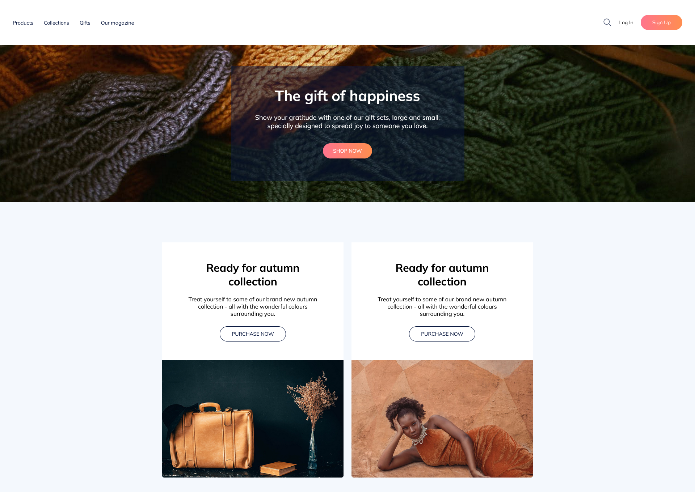
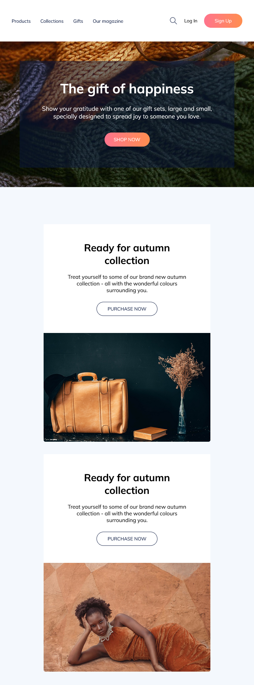
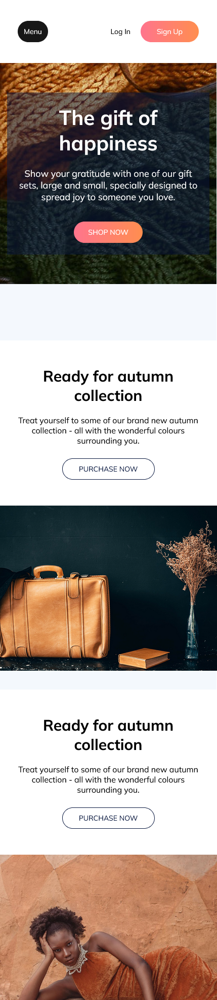
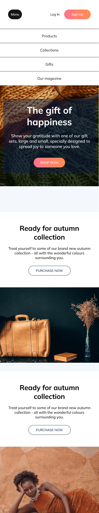

# UI Design Daily - Landing Page

## Description
This is a landing page based on a design from [UI Design Daily](https://www.uidesigndaily.com/posts/figma-webshop-landing-page-website-day-1243).

## Technologies
- HTML
- Sass
- TypeScript
- React

## Features
- Responsive design
- Toggleable menu

## How to Run
You can use this project in one of the following ways:

### Option 1: Use the Live Version
Simply open [this link](https://landing-page-2-gules-ten.vercel.app/) in your browser to access the application online

### Option 2: Run Locally
1. Clone the repository:
   ```bash
   git clone https://github.com/KreimerR/landing-page-2.git
   ```

2. Navigate to the project folder:
   ```bash
   cd landing-page-2
   ```

3. Install npm packages:
   ```bash
   npm install
   ```

4. Start the development server:
   ```bash
   npm run dev
   ```

## Screenshots




